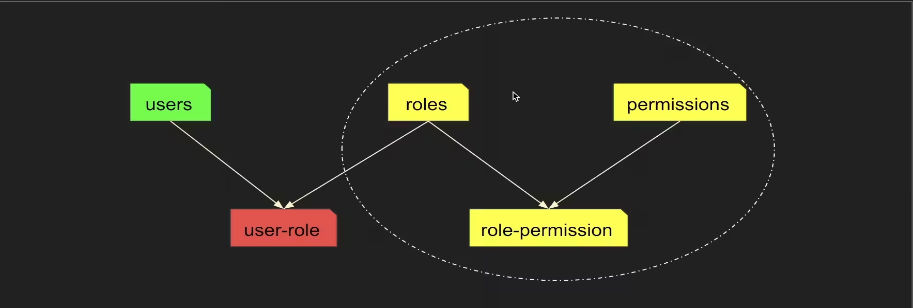

# PHÂN QUYỀN



#### TABLE

- **Permissions** (**`id`**, `name`, `desc`, `slug`)

- **Roles** (**`id`**, `name`, `desc`)

- **RolePermissions** (<u>**`permission_id`**</u>, <u>**`role_id`**</u>)

- **Users** (**`id`**, `display_name`, `username`, `password`)

- **UserRoles** (<u>**`user_id`**</u>, <u>**`role_id`**</u>)

#### SQL

```sql
CREATE DATABASE IF NOT EXISTS `roles` DEFAULT CHARACTER SET utf8 COLLATE utf8_unicode_ci;

USE `roles`;

CREATE TABLE IF NOT EXISTS `Permissions` (
`id` INT UNSIGNED NOT NULL AUTO_INCREMENT,
`name` VARCHAR(255) NOT NULL,
`desc` VARCHAR(255) NOT NULL,
`slug` VARCHAR(255) NOT NULL,
`created_at` TIMESTAMP DEFAULT CURRENT_TIMESTAMP,
`updated_at` TIMESTAMP DEFAULT CURRENT_TIMESTAMP ON UPDATE CURRENT_TIMESTAMP,
PRIMARY KEY `pk_id`(`id`)
) ENGINE = InnoDB;


CREATE TABLE IF NOT EXISTS `Roles` (
`id` INT UNSIGNED NOT NULL AUTO_INCREMENT,
`name` VARCHAR(255) NOT NULL,
`desc` VARCHAR(255) NOT NULL,
`created_at` TIMESTAMP DEFAULT CURRENT_TIMESTAMP,
`updated_at` TIMESTAMP DEFAULT CURRENT_TIMESTAMP ON UPDATE CURRENT_TIMESTAMP,
PRIMARY KEY `pk_id`(`id`)
) ENGINE = InnoDB;

CREATE TABLE IF NOT EXISTS `RolePermissions` (
`permission_id` INT UNSIGNED NOT NULL,
`role_id` INT UNSIGNED NOT NULL,
`created_at` TIMESTAMP DEFAULT CURRENT_TIMESTAMP,
`updated_at` TIMESTAMP DEFAULT CURRENT_TIMESTAMP ON UPDATE CURRENT_TIMESTAMP,
CONSTRAINT `fk_RolePermissions_Permissions` FOREIGN KEY (`permission_id`) REFERENCES `Permissions` (`id`) ON DELETE NO ACTION ON UPDATE CASCADE,
CONSTRAINT `fk_RolePermissions_Roles` FOREIGN KEY (`role_id`) REFERENCES `Roles` (`id`) ON DELETE NO ACTION ON UPDATE CASCADE,
PRIMARY KEY `pk_id`(`permission_id`, `role_id`)
) ENGINE = InnoDB;

CREATE TABLE IF NOT EXISTS `Users` (
`id` INT UNSIGNED NOT NULL AUTO_INCREMENT,
`display_name` VARCHAR(255) NOT NULL,
`username` VARCHAR(255) NOT NULL,
`password` VARCHAR(255) NOT NULL,
`created_at` TIMESTAMP DEFAULT CURRENT_TIMESTAMP,
`updated_at` TIMESTAMP DEFAULT CURRENT_TIMESTAMP ON UPDATE CURRENT_TIMESTAMP,
PRIMARY KEY `pk_id`(`id`)
) ENGINE = InnoDB;

CREATE TABLE IF NOT EXISTS `UserRoles` (
`user_id` INT UNSIGNED NOT NULL,
`role_id` INT UNSIGNED NOT NULL,
`created_at` TIMESTAMP DEFAULT CURRENT_TIMESTAMP,
`updated_at` TIMESTAMP DEFAULT CURRENT_TIMESTAMP ON UPDATE CURRENT_TIMESTAMP,
CONSTRAINT `fk_UserRoles_Users` FOREIGN KEY (`user_id`) REFERENCES `Users` (`id`) ON DELETE NO ACTION ON UPDATE CASCADE,
CONSTRAINT `fk_UserRoles_Roles` FOREIGN KEY (`role_id`) REFERENCES `Roles` (`id`) ON DELETE NO ACTION ON UPDATE CASCADE,
PRIMARY KEY `pk_id`(`user_id`, `role_id`)
) ENGINE = InnoDB;
```

## CÀI ĐẶT PACKAGE

#### Khởi tạo typescript `tsconfig.json`

```sh
npm install typescript -g
tsc --init
```

#### Câu hình file `tsconfig.json` như sau:

```json
{
  "compilerOptions": {
    "target": "es2016",
    "experimentalDecorators": true,
    "emitDecoratorMetadata": true,
    "module": "commonjs",
    "baseUrl": ".",
    "paths": {
      "@src/*": ["src/*"]
    },
    "esModuleInterop": true,
    "forceConsistentCasingInFileNames": true,
    "strict": true,
    "skipLibCheck": true
  }
}
```

#### Install dev dependencies

```sh
npm install typescript ts-node-dev tsconfig-paths @types/express @types/config pino-pretty @types/lodash @types/jsonwebtoken @types/cors @types/compression @types/morgan @types/bcrypt -D
```

#### Install dependencies

```sh
npm install mysql2 config bcrypt pino dayjs nanoid lodash jsonwebtoken dotenv zod cors compression helmet morgan
```

#### Cài đặt file `package.json`

```json
"scripts": {
  "start": "ts-node -r tsconfig-paths/register server.ts",
  "dev": "ts-node-dev --cls -r tsconfig-paths/register server.ts",
  "build": "npm install"
},
```

#### Câu lệnh khởi tạo file `.gitignore`

```sh
npx gitignore node
```
